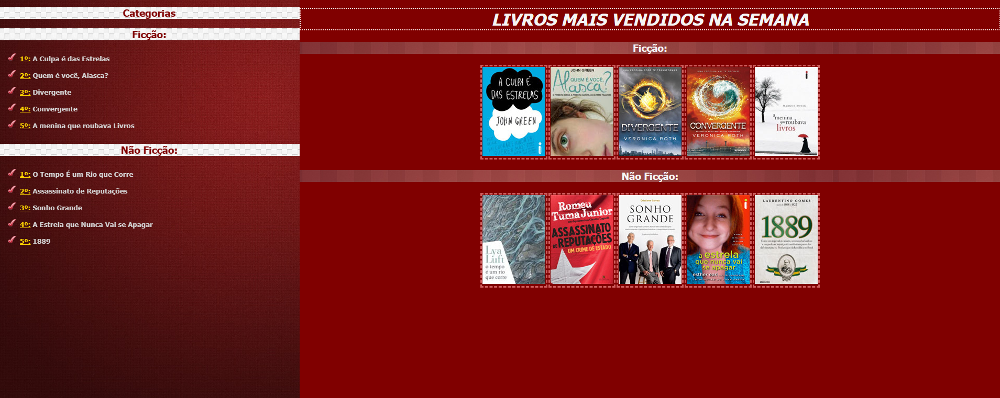
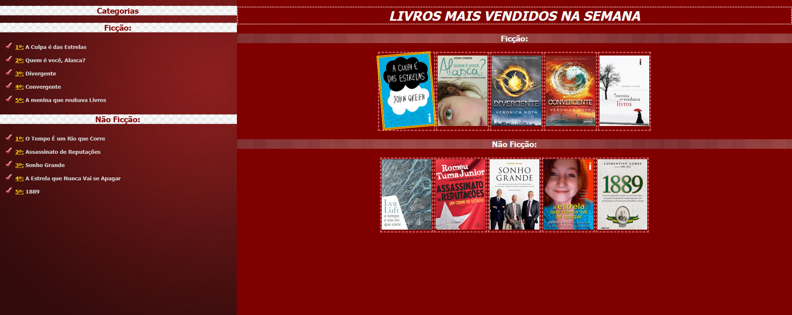
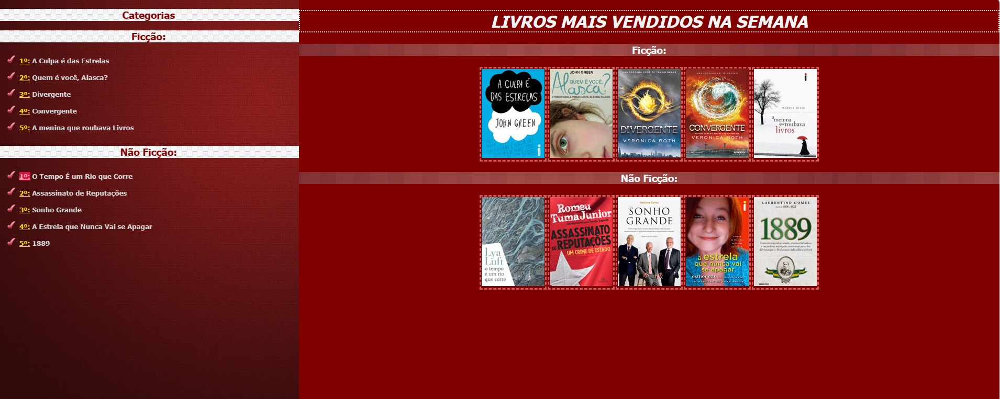
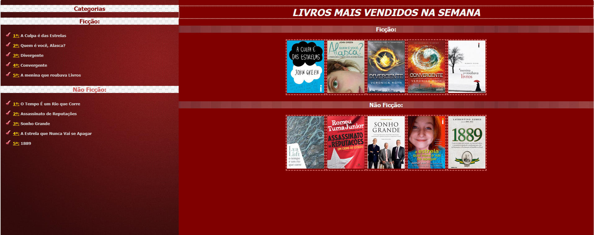
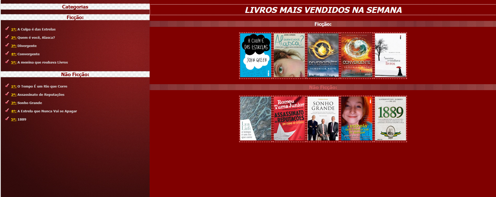

# atividadeCSS-Livros
primeira atividade de css feita em aula com um site sobre livros com o prof Rodrigo. Atividade do DS1 na Etec de Guarulhos.
  

  <h3>A página</h3>
  

  

  <h3>E aqui vão uns efeitos quando passa o mouse em cima</h3>
  

